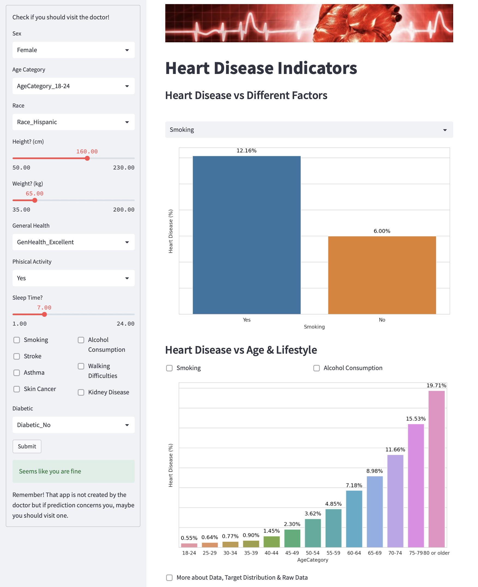

# Heart Disease Patients Classification with a Web App
###### METIS Data Science and Machine Learning Bootcamp 2022 by Krystian Krystkowiak
###### project/month(7/7) focus: ENGENEERING
#### Code - [GitHub](https://github.com/Krystkowiakk/Plastic-or-Glass---Image-Classification-with-Deep-Learning/blob/main/2.%20Krystkowiak_Krystian_Project_5_Plastic%20or%20Glass%20-%20Image%20Classification%20with%20Deep%20Learning.ipynb)
#### Presentation [GitHub](https://github.com/Krystkowiakk/Plastic-or-Glass---Image-Classification-with-Deep-Learning/blob/main/Project%20Presentation/Krystkowiak_Krystian_Project_5_Plastic%20or%20Glass%20-%20Image%20Classification%20with%20Deep%20Learning.pdf)
#### Web App [Streamlit](https://krystkowiakk-heart-disease-pa-streamlit-appstreamlit-app-cjy0xv.streamlit.app)

ABSTRACT

- Developed a pipeline for data processing and deployment, using a SQL database and deploying the resulting model through Github and Streamlit to create a web application for exploring data and predicting heart disease risk.
- The goal of this project was to develop a web application that could aid in identifying individuals at high risk for heart disease. The data used in this project was sourced from Kaggle and stored in a SQL database. The data was then processed using various Python libraries and machine learning techniques. The web application was developed using the Streamlit framework, and the code was managed and version controlled through GitHub. The project was described during a 5-minute presentation. 

DESIGN

Our target clientele for this project includes medical institutions and a wide range of businesses where heart disease is a concern, such as insurance companies, medical apps, fitness centers, and nutritionists. Additionally, the app is particularly useful for individuals who are conscious about their health and designed to increase awareness and raise red flags during initial questionnaires.

The dataset used for this project was sourced from the Centers for Disease Control and Prevention (CDC) and is a major part of the Behavioural Risk Factor Surveillance System (BRFSS), which conducts annual telephone surveys to gather data on the health status of U.S. residents. The BRFSS completes more than 300,000 adult interviews annually, making it the largest continuously conducted health survey system in the world. The most recent dataset (as of February 15, 2022) includes data from 2020. 

DATA

The data used for this project was sourced from Kaggle, from a dataset that was initially cleaned by Kamil Pytlak. The dataset can be found at the following link: www.kaggle.com/datasets/kamilpytlak/personal-key-indicators-of-heart-disease.

The dataset includes over 319,000 observations, with each individual row having 19 columns. The columns include various indicators related to heart disease and health.

The target variable for the model is HeartDisease and other relevant data columns are BMI, Smoking, AlcoholDrinking, Stroke, AlcoholDrinking, PhysicalHealth, MentalHealth, DiffWalking, Sex, AgeCategory, Race, Diabetic, PhysicalActivity, GenHealth, SleepTime, Asthma, KidneyDisease, SkinCancer.

PIPELINE

TOOLS

- SQL and SQLAlchemy for data storage
- Python Pandas and Numpy for data processing
- Python sklearn for classification modeling
- Python Seaborn and Plotly for data visualization
- GitHub for version control and project management
- Streamlit for web app deployment.

COMMUNICATION

5 minutes recorded video presentation with visualisation and web app with visually pleasing, informative charts, summarizing key findings: https://krystkowiakk-heart-disease-pa-streamlit-appstreamlit-app-cjy0xv.streamlit.app/

